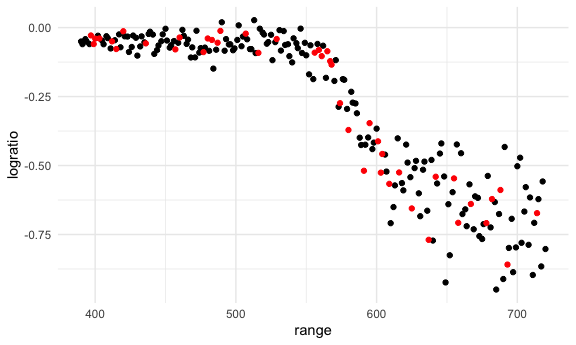
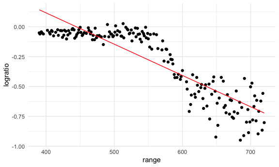
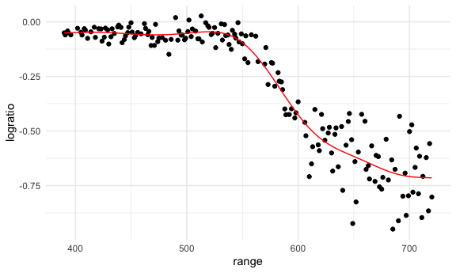
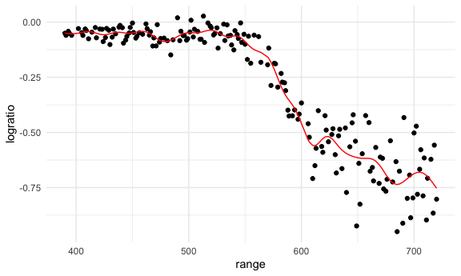
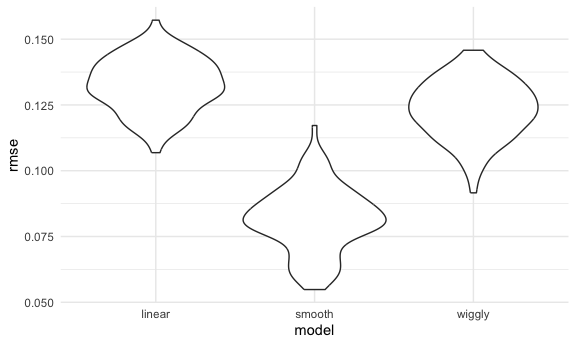

Cross validation
================
Sergio Ozoria
2025-11-11

# Model selection

List of confounders –\> issue concerned about –\> does exposure tell me
something about the outcome –\> testing hypothesis in the context of
confounders

Overfitting -\> chasing noise –\> high bias (missing something) and high
variance (model to model variability)

Questioning fit –\> could this model be used in another dataset

Flexibility vs fit –\> complexity depends on on high bias, underfit, and
high var, overfit –\> aim for the right point, for the right amount of
complexity

# Prediction accuracy

Dataset –\> build model –\> question fit –\> is it reproducible across
dataset –\> does it fit to make predictions

# Cross validation

Cross validation –\> see how well you can make predictions

how big are the residuals looking across the sample

Dataset –\> take one sample –\> taking training dataset –\> apply model
–\> conduct testing –\> make predictions in the future

# Refinements and variations

Take dataset –\> equally size groups –\> test group 1, then use the
other groups to test the model –\> does the model work across testing
groups?

# Prediction goal

Really important to understand causal diagrams in the real world based
on how the exposure is affecting the outcome, so prediction might not be
just the only goal here

There might be other confounding factors to take into account when
building a model –\> there might be other models that the test the
prediction of the exposure on the outcome out there that is builty
better and means it’s taking factors into account

# loading packages

``` r
library(tidyverse)
```

    ## ── Attaching core tidyverse packages ──────────────────────── tidyverse 2.0.0 ──
    ## ✔ dplyr     1.1.4     ✔ readr     2.1.5
    ## ✔ forcats   1.0.1     ✔ stringr   1.5.2
    ## ✔ ggplot2   4.0.0     ✔ tibble    3.3.0
    ## ✔ lubridate 1.9.4     ✔ tidyr     1.3.1
    ## ✔ purrr     1.1.0     
    ## ── Conflicts ────────────────────────────────────────── tidyverse_conflicts() ──
    ## ✖ dplyr::filter() masks stats::filter()
    ## ✖ dplyr::lag()    masks stats::lag()
    ## ℹ Use the conflicted package (<http://conflicted.r-lib.org/>) to force all conflicts to become errors

``` r
library(modelr)
library(mgcv)
```

    ## Loading required package: nlme
    ## 
    ## Attaching package: 'nlme'
    ## 
    ## The following object is masked from 'package:dplyr':
    ## 
    ##     collapse
    ## 
    ## This is mgcv 1.9-3. For overview type 'help("mgcv-package")'.

``` r
library(p8105.datasets)

set.seed(1)

knitr::opts_chunk$set(
  fig.width = 6,
  fig.asp = .6,
  out.width = "90%"
)

theme_set(theme_minimal() + theme(legend.position = "bottom"))

options(
  ggplot2.continuous.colour = "viridis",
  ggplot2.continuous.fill = "viridis"
)

scale_colour_discrete = scale_colour_viridis_d
scale_fill_discrete = scale_fill_viridis_d
```

Loading dataset

``` r
data("lidar")
```

Look at data

``` r
lidar
```

    ## # A tibble: 221 × 2
    ##    range logratio
    ##    <dbl>    <dbl>
    ##  1   390  -0.0504
    ##  2   391  -0.0601
    ##  3   393  -0.0419
    ##  4   394  -0.0510
    ##  5   396  -0.0599
    ##  6   397  -0.0284
    ##  7   399  -0.0596
    ##  8   400  -0.0399
    ##  9   402  -0.0294
    ## 10   403  -0.0395
    ## # ℹ 211 more rows

``` r
lidar_df = 
  lidar |> 
  as_tibble() |>
  mutate(id = row_number())

lidar_df |> 
  ggplot(aes(x = range, y = logratio)) + 
  geom_point()
```


# create dataframes

``` r
train_df = 
  sample_frac(lidar_df, size = .8) |> 
  arrange(id)

train_df = sample_frac(lidar_df, size = .8)
test_df = anti_join(lidar_df, train_df, by = "id")

ggplot(train_df, aes(x = range, y = logratio)) +
  geom_point() +
  geom_point(data = test_df, color = "red")
```



# fit a few models into training dataset

``` r
linear_mod = lm(logratio ~ range, data = train_df)
smooth_mod = mgcv::gam(logratio ~ s(range), data = train_df)
wiggly_mod = mgcv::gam(logratio ~ s(range, k = 30), sp = 10e-16, data = train_df)
```

# Let’s look at it

``` r
train_df |> 
  add_predictions(linear_mod) |> 
  ggplot(aes(x = range, y = logratio)) +
  geom_point() +
  geom_line(aes(y = pred), color = "red")
```



``` r
train_df |> 
  add_predictions(smooth_mod) |> 
  ggplot(aes(x = range, y = logratio)) +
  geom_point() +
  geom_line(aes(y = pred), color = "red")
```



``` r
train_df |> 
  add_predictions(wiggly_mod) |> 
  ggplot(aes(x = range, y = logratio)) +
  geom_point() +
  geom_line(aes(y = pred), color = "red")
```



Try computing our RMSEs

``` r
rmse(linear_mod, test_df)
```

    ## [1] 0.1302561

``` r
rmse(smooth_mod, test_df)
```

    ## [1] 0.06477024

``` r
rmse(wiggly_mod, test_df)
```

    ## [1] 0.06726076

# Iterate

``` r
cv_df =
  crossv_mc(lidar_df, n = 100) |> 
  mutate(
    train = map(train, as_tibble),
    test = map(test, as_tibble)
  )
```

Did this work? YEESSSSSSSSSSSSSS!!!!

``` r
cv_df |> pull(train) |>  nth(5)
```

    ## # A tibble: 176 × 3
    ##    range logratio    id
    ##    <dbl>    <dbl> <int>
    ##  1   390  -0.0504     1
    ##  2   391  -0.0601     2
    ##  3   393  -0.0419     3
    ##  4   394  -0.0510     4
    ##  5   399  -0.0596     7
    ##  6   400  -0.0399     8
    ##  7   402  -0.0294     9
    ##  8   403  -0.0395    10
    ##  9   405  -0.0476    11
    ## 10   406  -0.0604    12
    ## # ℹ 166 more rows

``` r
cv_df = cv_df |> 
  mutate(
    linear_fits = map(train, \(df) lm(logratio ~ range, data = df)),
    smooth_fits = map(train, \(df) mgcv::gam(logratio ~ s(range), data = df)),
    wiggly_fits = map(train, \(df) mgcv::gam(logratio ~ s(range, k = 50), sp = 10e1-8, data = df))
  ) |> 
  mutate(
    rmse_linear = map2_dbl(linear_fits, test, rmse),
    rmse_smooth = map2_dbl(smooth_fits, test, rmse),
    rmse_wiggly = map2_dbl(wiggly_fits, test, rmse)
  )
```

``` r
cv_df |> 
  select(starts_with("rmse")) |> 
  pivot_longer(
    everything(),
    names_to = "model", 
    values_to = "rmse",
    names_prefix = "rmse_") |> 
  mutate(model = fct_inorder(model)) |> 
  ggplot(aes(x = model, y = rmse)) + geom_violin()
```


